# RabbitMQAndGolang

## Описание проекта
Практическая работа по интеграции RabbitMQ с сервисами на Golang.

### THE TRUE STORY (РЕКОМЕНДУЮ К ПРОЧТЕНИЮ, ЧТОБЫ ЗНАТЬ ЧТО ЗА СЕРВИСЫ ТО)
   Сидит значит Татьяна Владимировна Ким в гланом офисе свой компании "Дикая ягодка" и в ее кабинет забегает Ильдар Мангушев(главный поставщик айфонов по всей россии) и просит, чтобы в его личном кабинете поставщика была нормальная информация 
   об продажах, возвратах и карточках его товаров. 
   Долго умолять не пришлось. Лицо Татьяны приобрело вид подобное этому: 😈
   Отправила она продавца домой и сказала, чтобы он не беспокоился, а сама позвонила своим разработчикам и выдвинула такое ТЗ:
   Предоставить сервис подписок продавцам.
      Подписка должна включать дополнительные плюшки(limit), которые не будут доступны продавцам без подписки 
      Например:
         limit1: Дает возможность создать две карточки одного и того же товара и сравнивать, по какой карточке товар продается лучше
         limit2: Можно ставить теги на свои товары. Чтобы можно было помочать несколько товаров на одной фотографии
         limit3: Можно вместо фото поставить видео с обзором на товар
         limit4: Делить товары на категории. Например: какая то мама покупает подгузники своему ребенку, переходит на полный католог товаров продаца, чтоб посмотреть есть ли у сейлера подгузники другого размера. И если у продавца есть этот лимит то эта мама не увидит товары другой категории у этого продавца, например какие нибудь игрушки 18+
         (тейк реальный, кто-то так продает, сам в шоке, угорали всей командой, но лимит такой создали))))

### Как оно работает ????
В сервисе `subscriptions` есть ручка `ActiveSubscription`, которая создаёт запись о подписке в базе данных и отправляет сообщение в RabbitMQ о её активации. После этого сервис  `limits` получает уведомление от RabbitMq и распределяет  лимиты на подписку. 
Визуализируем сказанное:
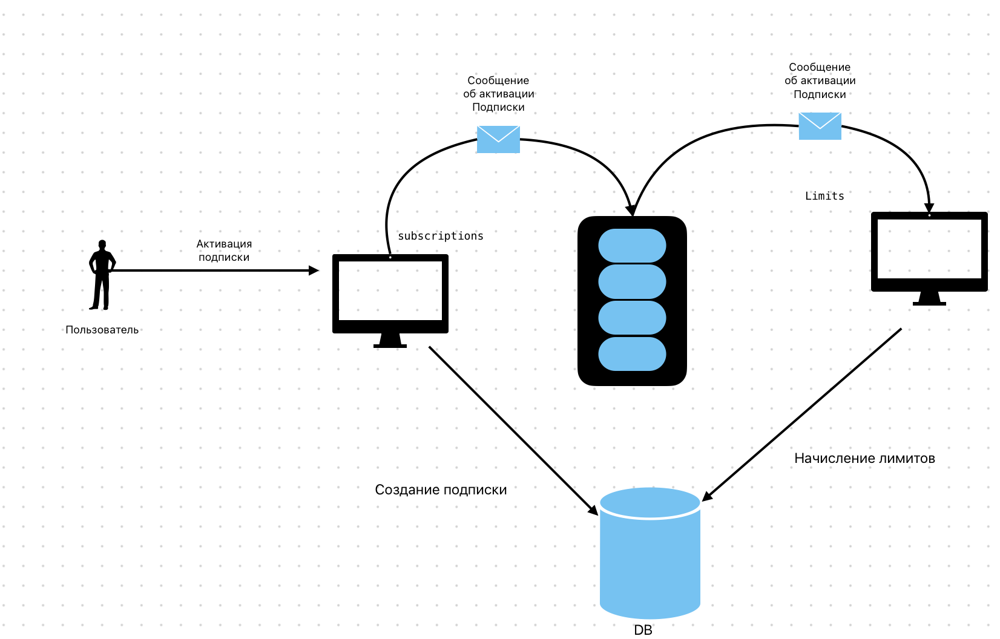

## Цели задания
1. Настроить подключение к RabbitMQ.
2. Запустить сервис подписок.
3. Проверить работу очереди сообщений в RabbitMQ.
4. Проверить корректность обработки сообщений сервисом лимитов.
5. Потестировать отказоустойчивость и репликацию RabbitMQ.
6. (Опционально) Реализовать дополнительную обработку подписок или новый тип считывателя сообщений.

## Теоритический минимум
Брокеры сообщений — посредники между сервисами. Они находятся в центре архитектуры и управляют потоками информации. Благодаря этому каждый сервис может послать сообщение другому сервису или целой группе сервисов. Такой подход стал популярен с развитием микросервисов и заставил пересмотреть отношение к отказоустойчивости.
В сложных системах, системах с вычислительными задачами, а также требующих гарантированной доставки важно организовать распределённую архитектуру и наладить коммуникацию между компонентами. Для решения задач с подобными вводными требованиями выбирают RabbitMQ – брокер сообщений с открытым исходным кодом. В настоящей работе рассмотрим основные сценарии его использования и разберём, когда и зачем нужен RabbitMQ [1].
Практически любой из широко известных сервисов, почти наверняка использует брокер сообщений. Это не обязательное условие, но оно считается одним из показателей зрелости системы. По мере развития сервиса и усложнения бизнес-функционала потребность в брокере сообщения только возрастает. Поэтому чем раньше начать его использовать, тем меньше костылей и технического долга появится в проекте.
Асинхронный подход решает множество задач. Вместо того, чтобы планировать архитектуру, где каждый компонент посылает запросы к другим компонентам и ожидает от них ответа, вы просто отправляете сообщение в брокер. А один или несколько сервисов получают это сообщение и обрабатывают его в удобное время, что позволяет не блокировать программы. Если же у вас одни сервисы синхронно ждут другие, вы очень быстро упираетесь в ограничение по ресурсам, когда скорость всей системы равна скорости её самого медленного компонента.
### Зачем использовать брокеры сообщений
Если сломается брокер, в худшем случае вы потеряете часть сообщений, но ядро сервиса всё ещё будет работать, так как берет информацию из базы данных. Сообщения будут накапливаться, и когда сервер вернётся, то быстро прочитает и обработает образовавшийся долг. Но иногда возникает частичная деградация: какая-то информация может оказаться не самой актуальной, хотя пользователи, скорее всего, этого даже не заметят. Пример — новостная лента в соцсетях. Если она не будет обновляться некоторое время, вы все равно сможете посмотреть опубликованные посты. 
Бывает, что сервисы, спроектированные и написанные в краткие сроки, не имеют брокера сообщений. Потребность реализовать этот функционал осознаётся значительно позже. И здесь есть два варианта. Первый — сэкономить и в качестве брокера сообщений использовать базу данных. Это не очень хорошо, потому что решает проблему только на раннем этапе.
Второй вариант — настроить брокер сообщений. Так вы сможете обеспечить своему приложению технологический запас для будущего развития. Одним из наиболее популярных брокеров сообщений остаётся RabbitMQ.
### Что такое RabbitMQ
RabbitMQ — распределённый и горизонтально масштабируемый брокер сообщений. Упрощённо его устройство можно описать так:
•	паблишер, который отправляет сообщения;
•	очередь, где хранятся сообщения;
•	подписчики, которые выступают получателями сообщений.
RabbitMQ передаёт сообщения между поставщиками и подписчиками через очереди. Сообщения могут содержать любую информацию, например, о событии, произошедшем на сайте. 
RabbitMQ отлично подходит для интеграции разных компонентов, создания микросервисов, потоковой передачи данных в режиме реального времени или при передаче работы удалённым работникам. Его используют крупные компании, в числе которых Bloomberg, Reddit, WeWork, NASA и др. 
### Почему выбирают RabbitMQ
RabbitMQ поддерживает несколько протоколов: AMQP, MQTT, STOMP и др., что позволяет использовать его в разных сценариях.
AMQP (Advanced Message Queuing Protocol) – это стандартный протокол для обмена сообщениями между различными компонентами программного обеспечения. Он используется для надежной и эффективной передачи сообщений между приложениями и сервисами, работающими на разных платформах и языках программирования. AMQP позволяет создавать очереди сообщений, управлять ими, а также обеспечивает подтверждение доставки сообщений и управление потоком данных.
RabbitMQ хранит сообщение до тех пор, пока принимающее приложение не подключится и не получит его из очереди. Клиент может подтвердить получение сообщения сразу или после того, как полностью обработает его. Как только такое подтверждение получено, сообщение удаляется из очереди. 
Для сравнения в Kafka очередь сообщений является постоянной — данные хранятся, пока не истечёт указанный период или не будет достигнуто ограничение по размеру. Поэтому важно убедиться, что событие, которое должно произойти один раз, не воспроизводится многократно.
Основное преимущество RabbitMQ — гибкая маршрутизация. Сообщения маршрутизируются через exchange (обменник) перед попаданием в очереди. RabbitMQ предлагает несколько встроенных типов обмена для типичной логики маршрутизации. 
RabbitMQ поддерживает приоритезацию в очередях и позволяет настроить диапазон приоритетов. Приоритет каждого сообщения устанавливается при его публикации. 
RabbitMQ предлагает простой пользовательский интерфейс управления. Он позволяет контролировать каждый аспект брокера сообщений. 
Обычно отмечают два варианта, когда стоит использовать RabbitMQ: для фоновой обработки данных и для интеграции внутри приложений и между ними, т.е. в качестве брокера сообщений между микросервисами. Рассмотрим оба сценария. 
Фоновая обработка данных — оптимальный сценарий использования RabbitMQ. Вы можете поместить сообщение в очередь без его немедленной обработки.
Пример: вы хотите загрузить отчёт из приложения. Приложение обрабатывает информацию и генерирует PDF-файл в течение 15-20 минут. Затем отправляет его вам по электронной почте. Очередь сообщений позволяет выполнить все задачи асинхронно.
Очереди RabbitMQ служат шинами событий и позволяют веб-серверам быстро реагировать на запросы вместо того, чтобы выполнять трудоемкие задачи на месте.
Также RabbitMQ часто используется для микросервисной архитектуры, где он выступает средством связи между приложениями и помогает избегать узких мест при передаче сообщений.
RabbitMQ — больше, чем просто брокер сообщений. Он основан на ERLANG и платформе Open Telecom, обеспечивающей высокую производительность при использовании минимальных ресурсов. Его выбирают, когда требуется надёжная доставка сообщений и гибкая маршрутизация.
Сравнение RabbitMQ и Kafka
•	Протоколы и API: RabbitMQ поддерживает множество протоколов и API, в то время как Kafka использует свой собственный протокол и API.
•	Скорость обработки: Kafka был разработан для обработки потоков данных и может обрабатывать миллионы сообщений в секунду, в то время как RabbitMQ обычно используется для обработки небольших объемов данных.
•	Распределенные системы: оба брокера сообщений поддерживают механизмы кластеризации и репликации для обеспечения отказоустойчивости и высокой надежности в распределенных системах.
•	Функциональность: RabbitMQ имеет более широкий набор функций, таких как маршрутизация сообщений, очереди с приоритетом, подтверждение доставки и т.д., в то время как Kafka имеет специализированные функции для обработки потоков данных.
•	Сложность: RabbitMQ более прост в использовании и может быть использован для обработки различных типов данных. В то время как Kafka, из-за своей специализации на обработке потоков данных, имеет более сложную архитектуру.
### Основные понятия RabbitMQ
Как было сказано ранее, в RabbitMQ существуют очереди и те, кто сообщения отправляют и получают сообщения. Рассмотрим подробнее: 
•	Producing – означает не что иное, как отправка. Программа, которая отправляет сообщения, является производителем.
•	Queue – очередь. Практически это имя почтового ящика в RabbitMQ. Хотя сообщения проходят через RabbitMQ и ваши приложения, они могут храниться только внутри очереди. Очередь ограничена только размерами памитя и места на диске, по сути, это большой буфер сообщений. Многие производители могут отправлять сообщения, которые идут в одну очередь, и многие потребители могут пытаться получить данные из одной очереди.
•	Consuming имеет то же значение, что и получение. Это программа-потребитель, которая в основном ожидает получения сообщений.
•	Exchange — обменник или точка обмена. В него отправляются сообщения. Exchange распределяет сообщение в одну или несколько очередей. Он маршрутизирует сообщения в очередь на основе созданных связей (bindings) между ним и очередью.

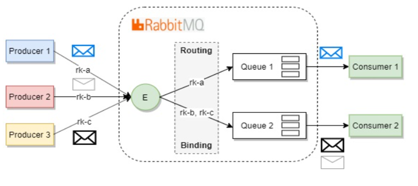
---

## Установка и настройка окружения

### 1. Предустановка Docker и Golang
#### 1.1 Установка Docker
1. Перейдите по ссылке [Docker Installation](https://docs.docker.com/desktop/setup/install/windows-install/).
2. Установите Docker Desktop.
3. Запустите Docker и выдайте необходимые разрешения.
4. После успешной загрузки, проверьте, что приложение запущено)))).
   
   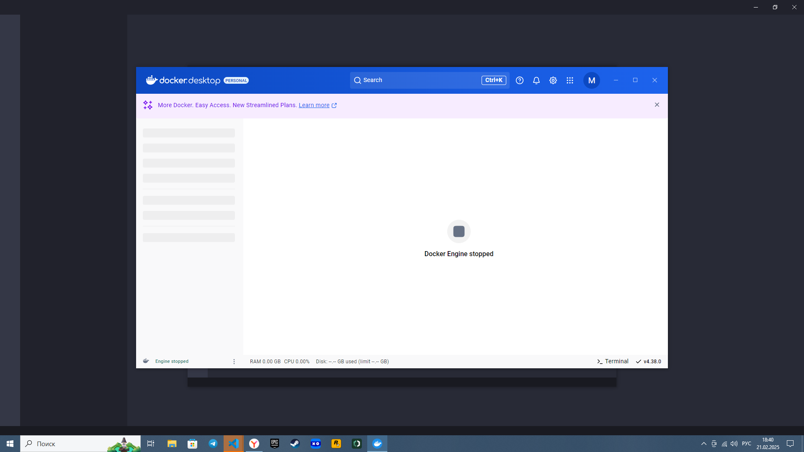

#### 1.2 Установка Golang
1. Перейдите по ссылке [Golang Installation](https://go.dev/doc/install).
2. Установите компилятор.
3. Перезагрузите ПК (рекомендуется).
4. Проверьте корректность установки:
   ```sh
   go version
   ```
   Если установка прошла успешно, вы увидите вывод версии Go.
   
   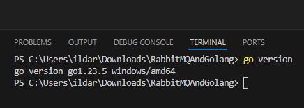

---

### 2. Клонирование репозитория
1. Перейдите в репозиторий [GitHub](https://github.com/mbatimel/RabbitMQAndGolang).
2. Скопируйте ссылку репозитория (через HTTPS).
3. Откройте терминал, перейдите в нужную директорию и выполните команду:
   ```sh
   git clone <HTTPS-URL>
   ```
    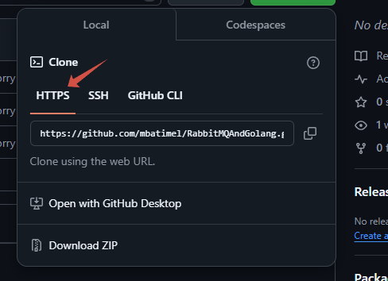
---

### 3. Открытие проекта в VSCode
1. Откройте VSCode.
2. Перетащите папку с проектом в окно редактора (drag & drop).

   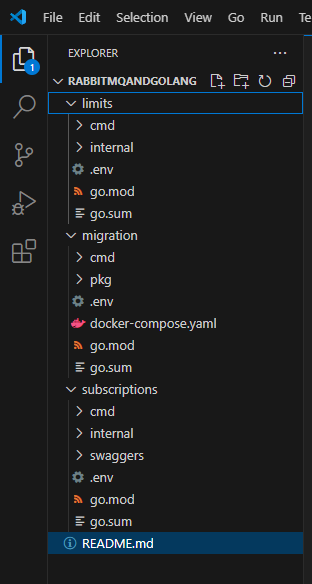

---

### 4. Запуск миграций и контейнеров
1. Откройте терминал (Win: Ctrl + J в VSCode, MacOS: commad+j).
2. Откройте 5 вкладок терминала.
3. Перейдите в папку с миграциями:
   ```sh
   cd migration
   ```
   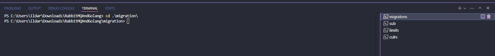
4. Запустите контейнеры:
   ```sh
   docker-compose up
   ```
5. После успешного запуска контейнеров:
   - В терминале появятся логи.
   - В Docker Desktop будут отображены активные контейнеры.
   
    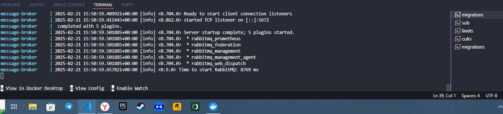
    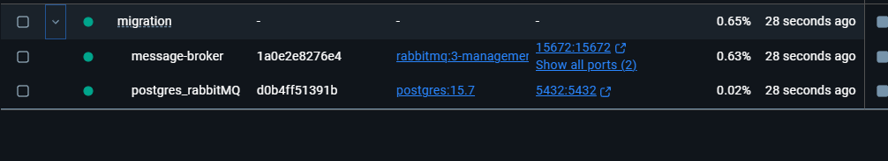

---

### 5. Запуск сервисов
#### 5.1 Запуск миграций
1. В новом терминале снова перейдите в `migration`.
2. Выполните команду для загрузки переменных из `.env`:
Win:
   ```powershell
   Get-Content .env | ForEach-Object {
       if ($_ -match '^\s*([^=]+)=(.*)\s*$') {
           $key = $matches[1]
           $value = $matches[2]
           [System.Environment]::SetEnvironmentVariable($key, $value, [System.EnvironmentVariableTarget]::Process)
       }
   }
   ```
MacOS:
   ```terimnal
   set -a && source .env && set +a
   ```
3. Запустите миграции:
   ```sh
   go run .\cmd\main.go
   ```
4. Успешное выполнение миграций подтверждается логами в терминале.
   
   
   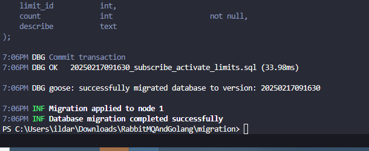

#### 5.2 Подключение к базе данных в VSCode
1. Установите оба расширения для работы с PostgreSQL.

   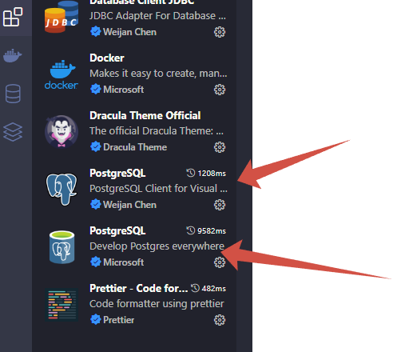
2. Настройте подключение к контейнеру.

   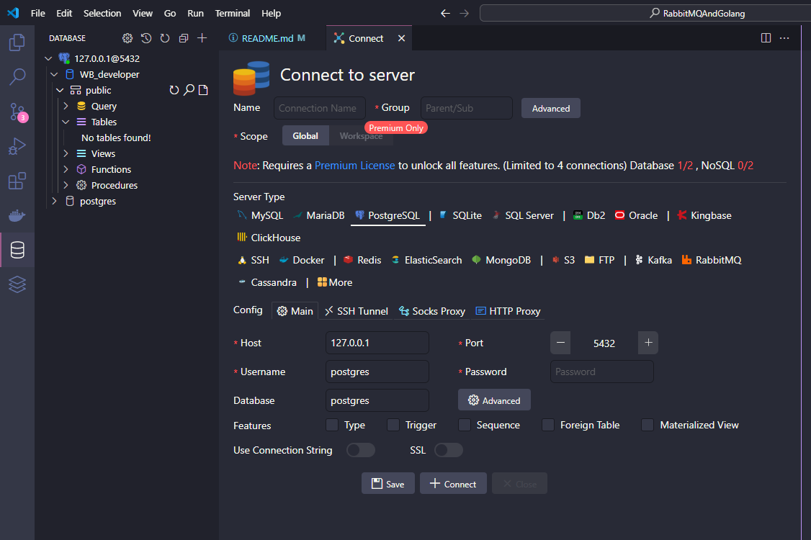
3. Если все хорошо то мы увидим структуру нашей БД =>

    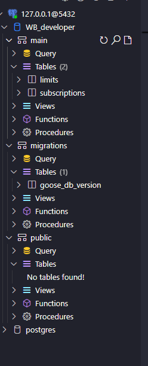
---

### 6. Запуск сервиса подписок
1. Перейдите в папку `subscriptions`:
   ```sh
   cd subscriptions
   ```
2. Выполните команду для загрузки переменных:
   ```powershell
   Get-Content .env | ForEach-Object {
       if ($_ -match '^\s*([^=]+)=(.*)\s*$') {
           $key = $matches[1]
           $value = $matches[2]
           [System.Environment]::SetEnvironmentVariable($key, $value, [System.EnvironmentVariableTarget]::Process)
       }
   }
   ```
   MacOS:
   ```terimnal
   set -a && source .env && set +a
   ```

3. Запустите сервис:
   ```sh
   go run .\cmd\main.go
   ```
4. Если запуск успешен, в логах появится информация от `fiber`.
   
   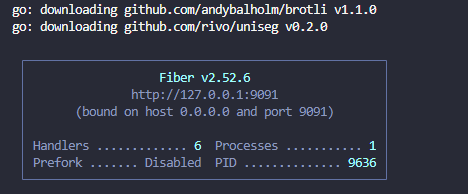

---

### 7. Проверка работы API
#### 7.1 Активация подписки
1. В терминале выполните команду:

MacOS:
   ```sh
   curl --location --request POST 'http://localhost:9000/api/v1/activesubscription?limitId=1&price=1000'
   ```
Win:
   ```sh
   curl -Method Post -Uri "http://localhost:9000/api/v1/activesubscription?limitId=1&price=1000"
   ```
2. Если запрос успешен, в логах появится подтверждение и вы в базе данных в таблице main.subscriptions мы увидем новое поле.
3. Откройте браузер и перейдите на `localhost:15672` для просмотра состояния очереди сообщений.
   
   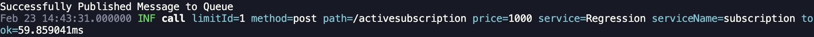

   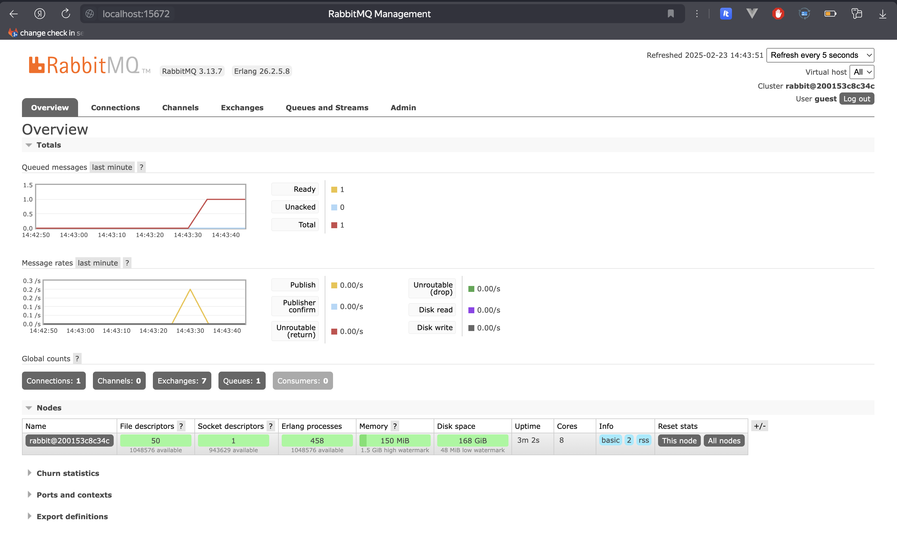

---

### 8. Запуск сервиса лимитов
1. Перейдите в папку `limits`:
   ```sh
   cd limits
   ```
2. Загрузите переменные окружения (аналогично шагу 6.2).
3. Запустите сервис:
   ```sh
   go run .\cmd\main.go
   ```
4. В логах должна появиться информация об успешном подключении к RabbitMQ.
   
   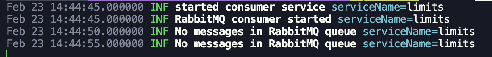

---

### 9. Проверка базы данных
1. Подключитесь к базе данных.
2. Проверьте, что подписка успешно записана.
   
   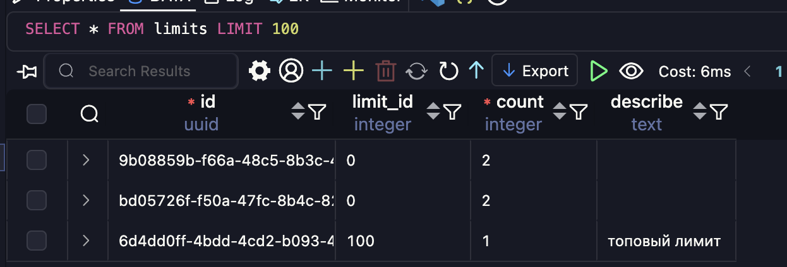
   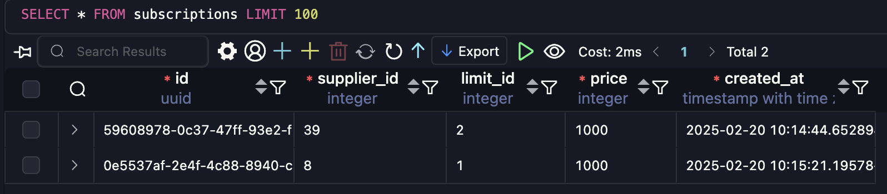

---

## Дополнительно
### Возможные ошибки и их исправления
#### Ошибка `panic: can not get version for db 1, pq: schema "migrations" does not exist`
1. Выполните действия, указанные на скриншоте.
    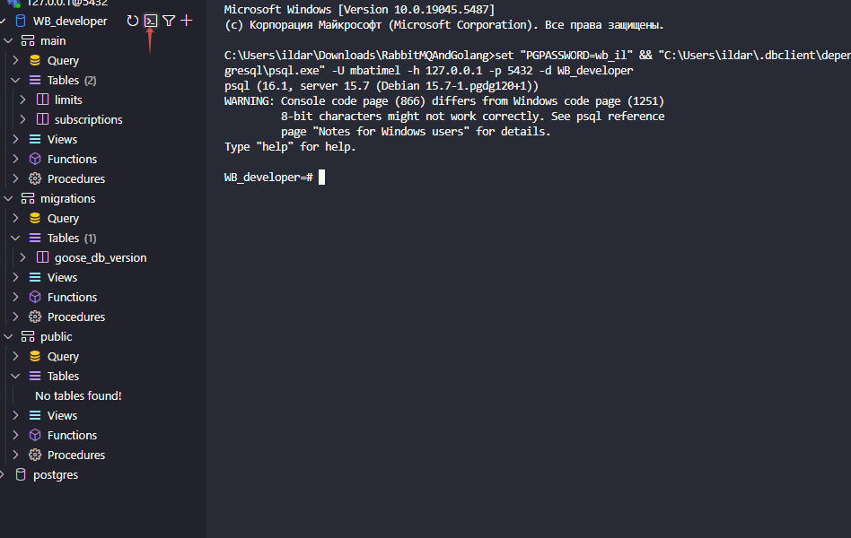
2. Пропишите команду (указанную на скрине).
    
3. Повторно выполните:
   ```sh
   go run .\cmd\main.go
   ```

---

Готово! 🎉 Теперь сервисы работают, а очередь сообщений в RabbitMQ обрабатывается корректно!

